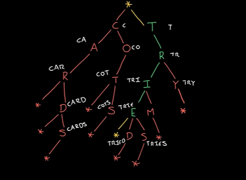
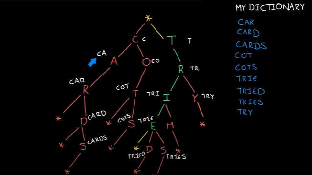

1. What is Trie?

+ Trie is a data structure that is actually a type of tree.
+ It is often used to store characters.

2. How Trie works?

+ Each node of Trie contains character as its data.



+ If we look at the path from the root (example node T) down as the precede image, you will see that a part of word or a word can be formed in a path of Trie (example node E to form TRIE).
+ So it allows us to do a very quick lookups of particular words.

3. Example of Trie?

+ Example, we could use Trie to store a very small version of English language.



+ We can see that there are any words starting with CAR. There is also CARD, CARDS, etc.
+ So CAR is also a prefix and it allows you to do a very fast lookups.

4. Application of Trie?

+ It is a tree to store string.
+ The maximum number of children of a node is equal to the size of the alphabet.
+ Trie supports search, insert and delete operations in O(L) time where L is the length of the key.

5. Implementation of Trie?

+ First we need a class Node
+ Instead of having as we would in a binary search tree which is a pointer to the left and right node, we need a lookup table that maps from a character to that node.
+ Additionally, we need to know that the word is actually a complete word or a prefix word.

```c#
    public class Node { 
        private HashMap<character, Node> children;
        private bool isCompletedWord;
    }
```

+ So each node has a flag to do the check that if it is a complete word or a prefix one.